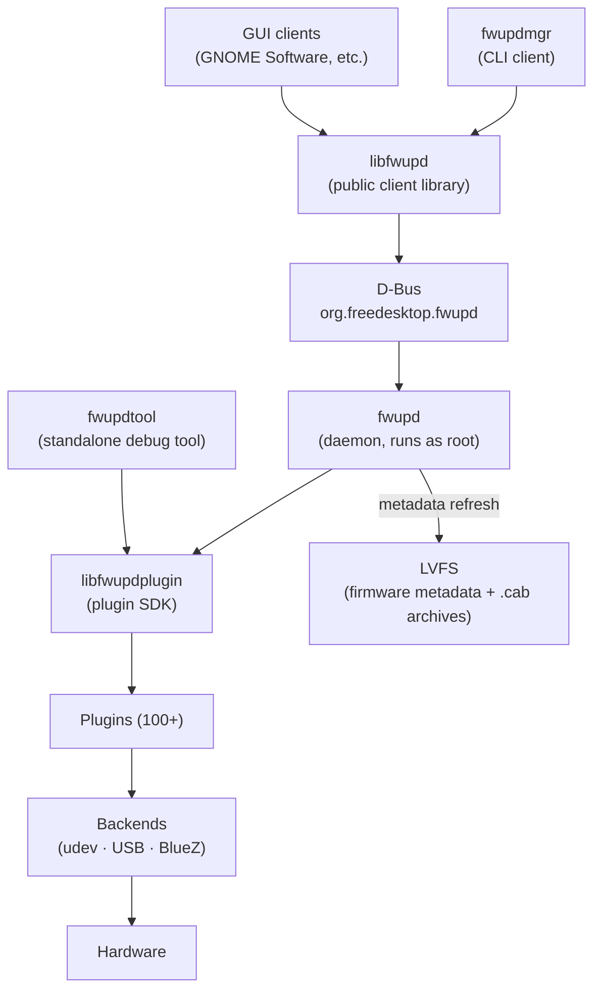

fwupd is made up of a daemon, two libraries, a set of backend subsystems, and more than 100 plugins. Understanding how these pieces connect helps you write, test, and debug plugins effectively.

## Component overview

## The three binaries

<CardGroup cols={3}>
  <Card title="fwupd" icon="server">
    The daemon. Runs as root under systemd. Loads all plugins at startup, manages device discovery, checks LVFS for updates, and installs firmware. Clients reach it over D-Bus.
  </Card>
  <Card title="fwupdmgr" icon="terminal">
    The command-line client for end users. Communicates with the running `fwupd` daemon over D-Bus. Use it to list devices, refresh metadata, check for updates, and install firmware.
  </Card>
  <Card title="fwupdtool" icon="wrench">
    The standalone developer tool. Loads and runs plugins directly — no daemon, no D-Bus. Use it to isolate a single plugin, parse firmware blobs, and iterate quickly without the noise of the full daemon.
  </Card>
</CardGroup>

## The two libraries

<CardGroup cols={2}>
  <Card title="libfwupd" icon="book">
    The public client library. Used by GUI frontends (such as GNOME Software), scripts, and `fwupdmgr` to talk to the daemon over D-Bus. The API and ABI are **stable** across releases.
  </Card>
  <Card title="libfwupdplugin" icon="puzzle-piece">
    The plugin SDK. Used by plugins and by `fwupdtool` to interact with hardware. The API is **partially stable**: symbols may be removed when branching for new minor versions. Use `./contrib/migrate.py` when upgrading out-of-tree plugins.
  </Card>
</CardGroup>

## D-Bus interface

All clients — `fwupdmgr`, GUI applications, and anything using `libfwupd` — communicate with the daemon through the `org.freedesktop.fwupd` D-Bus interface. This interface is the only public entry point to the daemon.

In the development environment, D-Bus activation is disabled. If you need to test daemon-and-client interaction, start the daemon manually in one terminal and the client in another.

## The plugin system

Plugins are loaded by the daemon at startup and ordered by their declared dependencies. Each plugin falls into one of three categories:

| Type | Role | Examples |
|---|---|---|
| **Mechanism** | Uploads firmware to hardware | `uefi-capsule`, `nvme`, `vli` |
| **Policy** | Controls system conditions during updates | Battery level check, AC power requirement |
| **Helper** | Provides extra device metadata or quirks | Vendor quirk providers |

fwupd ships with more than 100 plugins covering a wide range of protocols and hardware:

- **USB** — generic and vendor-specific USB devices
- **UEFI capsule** — BIOS/UEFI firmware via EFI runtime services
- **NVMe** — solid-state drive firmware
- **Thunderbolt** — Intel Thunderbolt controllers
- **Vendor-specific** — dedicated plugins for hardware from vendors such as Lenovo, Dell, Logitech, Synaptics, and many others

## Backend subsystems

Plugins interact with hardware through one of three backends, which abstract the underlying kernel interfaces:

| Backend | Kernel interface | Used for |
|---|---|---|
| **udev** | `libudev` | Most kernel devices (PCI, HID, I²C, etc.) |
| **USB** | `libusb` | USB peripherals |
| **BlueZ** | BlueZ D-Bus API | Bluetooth devices |

## The LVFS

The [Linux Vendor Firmware Service (LVFS)](https://fwupd.org/) is where firmware metadata and cabinet (`.cab`) archives are hosted. The daemon fetches metadata from the LVFS when you run `fwupdmgr refresh`. Each `.cab` archive contains the firmware binary and a signed metadata file.

The update flow from end to end:

1. **Discover** — a backend detects a device; the matching plugin probes it and registers it with the daemon.
2. **Match** — the daemon compares the device's GUIDs against LVFS metadata to find applicable releases.
3. **Verify** — the `.cab` archive signature is checked before any firmware is extracted.
4. **Install** — the mechanism plugin uploads the firmware to the hardware.

<Note>
  fwupd is configured by default to fetch firmware from the LVFS. OEMs and firmware creators can publish to the LVFS to make their firmware available to all Linux users.
</Note>
